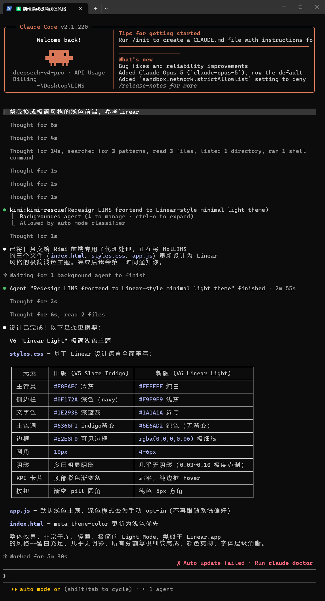

# kimi-plugin-cc

**Language / 语言:** [English](README.md) | [中文](README.zh-CN.md)

[](https://github.com/oppnc/kimi-plugin-cc/actions/workflows/ci.yml)
[](./LICENSE)
[](./CHANGELOG.md)

This repo does one thing: call local **[Kimi Code](https://github.com/MoonshotAI/kimi-code)** as a subagent from **Claude Code** or **Grok** (and compatible harnesses).

Kimi K3 is strong at frontend and multimodal work — and stronger inside Kimi Code. Professional benchmarks confirm this: K3 was trained with preserved thinking history, and if a harness doesn't send earlier reasoning back correctly, performance becomes unstable — Moonshot officially recommends using a verified harness like Kimi Code to maintain quality ([source](https://www.nxcode.io/resources/news/kimi-k3-benchmarks-coding-agent-evaluation-guide-2026)). Hugging Face's quantized record also shows K3 evaluated with the Kimi Code harness scores only 73.7 when run with the Claude Code harness ([source](https://huggingface.co/unsloth/Kimi-K3-GGUF)). More importantly, switching harnesses directly changes both the score **and** the operational cost — in other words, keeping K3 in Kimi Code is both more accurate and cheaper. If you're used to your harness and find switching tools a hassle, this plugin lets you call Kimi Code as a subagent right inside Claude Code / Grok, while K3 keeps working in its most familiar Kimi Code environment.

The plugin triggers Kimi automatically — the main agent MUST hand off to Kimi for any UI/interaction frontend work.
You can also request it explicitly, e.g. "let Kimi handle this page."
The auto-trigger rules live in the plugin (`agents/kimi-rescue.md` / `commands/rescue.md` descriptions); install it and you get default mandatory frontend/UI handoff out of the box. To tighten or loosen the trigger scope, add global instructions in `~/.claude/CLAUDE.md`, or adjust `AGENTS.md` per-repo.

This plugin is a **thin ACP bridge**: tools, swarm, skills, and models stay with Kimi Code, giving K3 its most familiar environment.

| | |
| --- | --- |
| **Version** | **0.2.1** |
| **Hosts** | Claude Code, Grok |
| **Node** | ≥ 18.18 |
| **Needs** | Kimi Code CLI installed + `kimi login` |

## Happy path (what you use day to day)

| Host | What to do |
| --- | --- |
| **Claude Code** | `/kimi:rescue <frontend or UI task>` |
| **Grok** | Main agent **must** spawn **`kimi:kimi-rescue`** (or `/kimi:rescue`) for frontend/UI — not implement UI itself |
| **When (required)** | Frontend/UI, style mocks/reference pages, CSS/layout, screenshot or **video** visual bugs, multi-file implement |

**Must not** re-implement that work in the main agent when Kimi is ready. Return Kimi’s output as-is.

> **Real run**: asked Kimi in Claude Code to redesign a LIMS frontend to a Linear-style light theme — Kimi independently completed all CSS/JS/HTML rewrites in 2m 55s.
>
> 

Advanced commands (`/kimi:task`, background jobs, status/result): see [AGENTS.md](AGENTS.md).

## Install

Needs: **Node.js ≥ 18.18**, local **[Kimi Code](https://github.com/MoonshotAI/kimi-code)** + `kimi login`.

### Paste into your agent

Copy the block below into Claude Code / Grok / any coding agent and let it install:

```text
Install the Kimi plugin from https://github.com/oppnc/kimi-plugin-cc

1. Prerequisites: Node.js ≥ 18.18, Kimi Code CLI installed and `kimi login` done.
2. Claude Code:
   /plugin marketplace add oppnc/kimi-plugin-cc
   /plugin install kimi@kimi-code-cc
   then /kimi:setup (if commands missing: /reload-plugins)
3. Grok:
   grok plugin install oppnc/kimi-plugin-cc#plugins/kimi --trust
4. Smoke-check with a small frontend task via /kimi:rescue (or Grok kimi:kimi-rescue).

Windows: if `kimi` is missing from PATH, set KIMI_CLI_PATH to the full path of
kimi.exe (often %USERPROFILE%\.kimi-code\bin\kimi.exe).
```

### Or install yourself

**Claude Code**

```text
/plugin marketplace add oppnc/kimi-plugin-cc
/plugin install kimi@kimi-code-cc
```

Then `/kimi:setup`. If commands are missing in the current session: `/reload-plugins`.

**Grok**

```bash
grok plugin install oppnc/kimi-plugin-cc#plugins/kimi --trust
```

## First verify (do this once)

### 1) Doctor

- Claude: `/kimi:setup`  
- Or CLI from a checkout:

```bash
node plugins/kimi/scripts/kimi-companion.mjs setup
```

You want `acp probe: ok` and a **Next (first verify)** section.

### 2) Hand a frontend task to Kimi

**Claude Code:**

```text
/kimi:rescue Implement a small responsive settings section using existing design tokens. Keep changes minimal.
```

**Grok:** ask the agent to run the Kimi rescue/handoff for the same frontend task.

**CLI probe** (no host plugin required):

```bash
node plugins/kimi/scripts/kimi-companion.mjs task --mode yolo -- "Reply with exactly: kimi-bridge-ok"
```

If that works, the bridge is healthy. Real work should use `/kimi:rescue` (or Grok equivalent) for frontend/UI.

## Troubleshooting

| Symptom | Fix |
| --- | --- |
| `BINARY_NOT_FOUND` | Install Kimi Code; `kimi login`; set `KIMI_CLI_PATH` if needed |
| `ACP_FAILED` / `LOGIN_REQUIRED` | Run `kimi login` in a normal terminal; re-run setup |
| `NODE_TOO_OLD` | Upgrade Node to ≥ 18.18 |
| `MEDIA_NOT_FOUND` | Use an absolute path or a path under the workspace Kimi uses |
| Commands missing after install | `/reload-plugins`; marketplace update when `version` changes |
| Plan mode “doesn’t edit files” | By design — use default **yolo** to implement |

Errors are prefixed with `[kimi-plugin]` and include a numbered **Fix** list — show them as-is.

## Compatibility

| Component | Requirement |
| --- | --- |
| This plugin | 0.2.1 |
| Node | ≥ 18.18 |
| Kimi Code | ≥ 0.30.0 (CLI with working `kimi acp` NDJSON). Setup prints `compat` + kimi version. Upgrade Kimi Code if ACP fails. |

## Related

| Package | Host |
| --- | --- |
| **kimi-plugin-cc** (this repo) | Claude Code / Grok |
| [kimi-plugin-codex](https://github.com/oppnc/kimi-plugin-codex) | OpenAI Codex |

Maintainer / agent details: [AGENTS.md](AGENTS.md) · Changelog: [CHANGELOG.md](CHANGELOG.md)

## License

MIT — see [LICENSE](./LICENSE). Kimi Code is a separate project.
